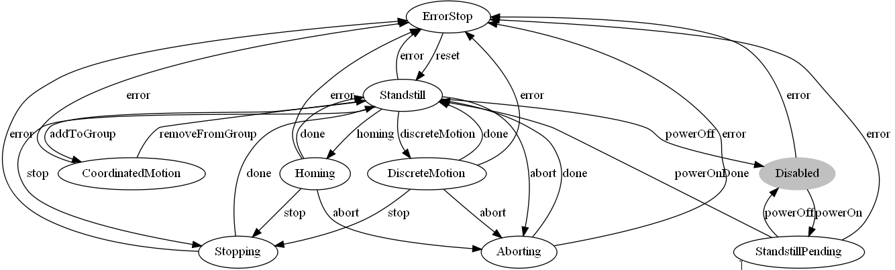
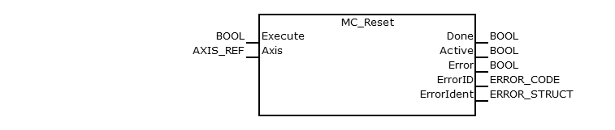
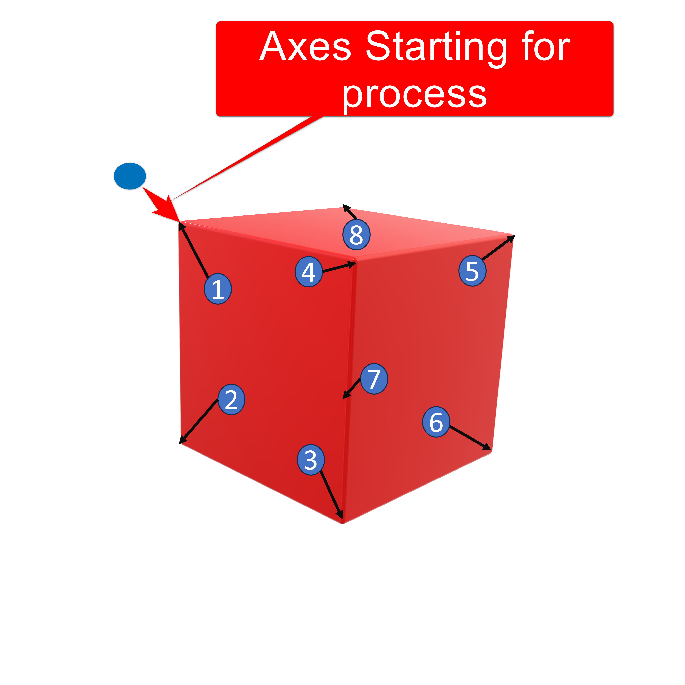

<h1 align="left">
  <br>
  
  <br>
  HEI-Vs Engineering School - Industrial Automation Base
  <br>
</h1>

Cours AutB

Author: [Cédric Lenoir](mailto:cedric.lenoir@hevs.ch)

# LAB 06 Gestion d'un mouvement discret. 

*Keywords:* **PLCopen State Machine MC_Power MC_MoveAbsolute MC_ReadStatus**

# Objectif
Piloter un axe avec des Function Blocs selon la norme PLCopen [PLCopen Motion Control Specifications](https://plcopen.org/technical-activities/motion-control) en utilsant une machine d'état robuste définie par des ``Enum``.

Dans ce travail, nous effectuerons uniquement des mouvements absolus avec des trajectoires définies par un **MC_MoveAbsolute**.

# Rappel Motion State Diagram
Il peut y avoir de légères différences d'un fabricant à l'autre, mais hormis ``StandstillPending``, on retrouve toujours les autres états.

L'état **CoordinatedMotion** est spécifique à une machine avec plusieurs axes coordonnés.

<figure>
    
    <figcaption>PLCopen Axis State Machine</figcaption>
</figure>

Dans le cadre du cours d'automation, nous utiliserons les états suivants:

<figure>
    
    <figcaption>Automation Lab State Diagram</figcaption>
</figure>


# Le job sans PackML
> Toutes les transitions vers ErrorStop ne sont pas représentées par soucis de lisibilité, mais dans la pratique, **n'importe quel état possède une transition vers ErrorStop**.

> **Aucune transition en dehors du ``CASE..OF`` n'est autorisée**, sauf pour réinitialiser le système sur Idle.

> **Les ``Execute`` et ``Enable`` des FB de commande ne dépendent que des états du ``CASE..OF``**, excepté pour le mode manuel.

Certaines contraintes peuvent paraître exagérées, mais c'est un exercice de rigueur de programmation.

> Une machine d'état pour un seul axe est déjà passablement compliquée si l'on n'utilise pas ``PackML``. **Dans la pratique, on évitera de travailler sans PackML et on ignorera cet exercice**.

<figure>
    
    <figcaption>State Machine Practical Work Move Absolute</figcaption>
</figure>

# Available structures ``STRUCT``.
## List of commands for MoveAbsolute ``ST_PlcOpenFbs``
```iecst
TYPE ST_PlcOpenFbs :
STRUCT
    // If TRUE, the FB are driven manually from the HMI
    bEnableRemote        : BOOL;
    bEnableReadStatus    : BOOL;
    bEnableReadPosition  : BOOL;
    bEnableReadVelocity  : BOOL;
    bMoveAbs             : BOOL;
    bStop                : BOOL;
    bPowerOn             : BOOL;
    bReset               : BOOL;
    // From arAxisStatus_gb[1].Data.PLCopenState;
    // Exist in Data Layer too, s=motion/axs/Axis_X/state/opstate/plcopen
    strGetAxisStatus     : STRING;
END_STRUCT
END_TYPE
```

> Les variables ``bEnableRemote``, ``bMoveAbs``, ``bStop``, ``bPowerOn``, ``bReset`` sont conçues pour piloter manuellement les Function Block, par exemple avec un OR sur un Execute

```iecst
mcStop(Axis := GVL_AxisDefines.X_Axis,
       Execute := (state = stateStop) OR
                  (stPlcOpenFbs.bEnableRemote AND stPlcOpenFbs.bStop));
```

## List of dynamic parameters for ``MC_MoveAbs``

```iecst
TYPE ST_SetMotionParam :
STRUCT
    rPosition_mm        : LREAL;
    rVeloctiy_mm_s      : LREAL;
    rAcceleration_mm_s2 : LREAL;
    rDeceleration_m_s2  : LREAL;
    rJerk_m_s3          : LREAL;
END_STRUCT
END_TYPE
```

## List of State Machine Status ``ST_StateMachineInfo``

```iecst
TYPE ST_StateMachineInfo :
STRUCT
    diState     : DINT;
    eState      : EN_MoveAbsStates;
    bIdle       : BOOL;
    bActive     : BOOL;
    bError      : BOOL;
    strState    : STRING;
END_STRUCT
END_TYPE
```

> Notez la variable ``strState`` de type ``STRING`` qui peut être utilisée dans le code pour documenter la machine d'état et simplifier le diagnostic de la machine.

```iecst
(*
    Main State Machine.
*)
CASE stStateMachineInfo.eState OF
    EN_MoveAbsStates.eIdle :
        stStateMachineInfo.strState := 'Idle';
        ;
```

## Enum for state
Integrated in ``ST_StateMachineInfo``, to be completed.

```iecst
TYPE EN_MoveAbsStates :
(
    eIdle := 999
)DINT := eIdle;
END_TYPE
```

# HMI
Une interface par défaut est fournie. Elle utilise les structure ci-dessus intégrées dans programme principal ainsi que quelques fonctions utlilitaire.

<figure>
    
    <figcaption>Practical Work06 Base ClassObjects</figcaption>
</figure>

On notera que ce diagramme n'intègre pas les ``Function Blocks`` nécessaires au **motion control**.

# Main function blocks PLCopen

## AXIS_REF
On a typiquement un accès de type ``VAR_IN_OUT`` qui fournit à chaque ``Function Block`` un axe référencé dans le noyau **Motion Control**.

Dans le système à notre disposition, on utilise une fonction spécifique qui permet de récupérer la référence à la structure pour ``AXIS_REF``.

Voir dans ``GVL_AxisDefines``

```iecst
VAR_GLOBAL
	  X_Axis: MB_AXISIF_REF :=(AxisName:='Axis_1',AxisNo:=1);
END_VAR
```

> ``Axis_1`` fait référence à un axe défini dans le noyau NC du ctrlX Core.

C'est la variable ``X_Axis``, qui est utilisée obligatoirement lors de l'appel d'un FB pour le Motion Control, par exemple pour ``MC_Stop``: 

```iecst

mcStop(Axis := GVL_AxisDefines.X_Axis,
       Deceleration := 1,
       Execute := stPlcOpenFbs.bStop);
```

```iecst

> On pourra définit des accès à d'autres axes de la manière suivante;
VAR_GLOBAL
	  Y_Axis: MB_AXISIF_REF :=(AxisName:='Axis_2',AxisNo:=2);
	  Z_Axis: MB_AXISIF_REF :=(AxisName:='Axis_3',AxisNo:=3);
END_VAR
```

## MC_Power 
### Short description
The function block controls the power adding (on or off).

<figure>
    
    <figcaption>MC_Power, source: Bosch Rexroth</figcaption>
</figure>

### Functional description
The function block implements the transition between the PLCopen states **DISABLED** and **STANDSTILL**.

This function is prerequisite for every motion command which moves an axis.

There is no differentiation between real or simulated axes.
### Possible error codes
The function block uses the CXA_TABLE, refer to CXA_Commontypes.ERROR_TABLE
Error detail information please see CXA_MOTION_ERR.

|Scope      |Name        |Type   |Comment    |
|-----------|------------|-------|-----------|
|VAR_INPUT  |``Enable``     |BOOL   |As long as ``Enable`` is true, power is being enabled|
|VAR_OUTPUT |``Status``      |BOOL   |Power state|
|VAR_OUTPUT |``Error``       |BOOL   |Indicates an error|
|VAR_OUTPUT |``ErrorID``     |ERROR_CODE|Class of error|
|VAR_OUTPUT |``ErrorIdent``  |ERROR_STRUCT |Detailed information about error|
|VAR_IN_OUT |``Axis``        |AXIS_REF     |Reference to the axis ``CONST``|

## MC_MoveAbsolute
### Short description
This Function Block commands a controlled motion to a specified absolute position.

<figure>
    
    <figcaption>MC_MoveAbsolute, source: Bosch Rexroth</figcaption>
</figure>

### Functional description
Prerequisite: The axis has to be in a powered state by **MC_Power**.

During the movement, the PLCopen state of the axis is set to DISCRETE_MOTION.
When the commanded target position is reached, the function block is set to state Done and the PLCopen state of the corresponding axis is set to **STANDSTILL**.

You can use **MC_ReadStatus** to determine the current state.

In case an error occurred before execution (e.g. violated dynamic limits, invalid command parameters) the function block will be set to state ``Error``.
In case an error occurred during execution, the axis state is set to **ERRORSTOP**.

If the function block is set as a ``mcAborting`` mode, all previous commands are discarded and the currently executed commanded will be interrupted.
In this case, the axis will still move continuously (within its new commanded dynamic limits) towards the new target position.

If the function block is set as a ``mcBuffered`` mode, this command will be buffered until all previous commands are executed done and the currently executed commanded will not be interrupted.
In this case, the axis will still move to velocity-zero and then move (within its new commanded dynamic limits) towards the new target position.

If the function block is interrupted by another function block which is set as ``mcAborting`` mode or **MC_STOP**, it will be set to state ``CommandAborted``.

If the function block works in ``Active`` state. It means current function block is executed

### Possible error codes
The function block uses the CXA_TABLE, refer to CXA_Commontypes.ERROR_TABLE

Error detail information please see CXA_MOTION_ERR.

|Scope      |Name        |Type   |Comment    |
|-----------|------------|-------|-----------|
|VAR_INPUT  |``Execute``     |BOOL   |Start the motion at rising edge|
|VAR_INPUT  |``Position``    |LREAL  |Commanded ``Position`` for the motion, *in technical unit* ``[u]``, negative or positive|
|VAR_INPUT  |``Velocity``    |LREAL  |Value of the maximum ``Velocity``, *not necessarily reached* ``[u/s]``.|
|VAR_INPUT  |``Acceleration``|LREAL  |Value of the ‘Acceleration’, always positive, *increasing energy of the motor* ``[u/s2]``|
|VAR_INPUT  |``Deceleration``|LREAL  |Value of the ‘Deceleration’, always positive, *decreasing energy of the motor* ``[u/s2]``|
|VAR_INPUT  |``Jerk``        |LREAL  |Value of ‘jerk’ (always positive) [u/s3]|
|VAR_INPUT  |``BufferMode``  |MC_BUFFER_MODE  |defines this FB execute immediately or push into the buffer|
|VAR_OUTPUT |``Done``        |BOOL   |Commanded position finally reached|
|VAR_OUTPUT |``InBuffer``      |BOOL   |Command is queued and to be executed.|
|VAR_OUTPUT |``Active``      |BOOL   |Execution in progress|
|VAR_OUTPUT |``CommandAborted``|BOOL   |``Command`` is aborted by another command|
|VAR_OUTPUT |``Error``       |BOOL   |Indicates an error|
|VAR_OUTPUT |``ErrorID``     |ERROR_CODE|Class of error|
|VAR_OUTPUT |``ErrorIdent``  |ERROR_STRUCT |Detailed information about error|
|VAR_IN_OUT |``Axis``        |AXIS_REF     |Reference to the axis ``CONST``|

## MC_Stop
### Short description
This function block generates a slowdown, **within the given dynamic limits**, until the axis is stopped, **velocity zero**.

<figure>
    
    <figcaption>MC_Stop, source: Bosch Rexroth</figcaption>
</figure>

### Functional description
During slowdown, the axis in state of **STOPPING**.

After the axis is stopped, the output Done is set and the PLCopen statemachine of the corresponding axis is set to state **STANDSTILL**.

This function block abort any ongoing function block execution. When **STANDSTILL** is reached the position is kept active.
### Possible error codes
The function block uses the CXA_TABLE, refer to CXA_Commontypes.ERROR_TABLE

Error detail information please see CXA_MOTION_ERR.

|Scope      |Name        |Type   |Comment    |
|-----------|------------|-------|-----------|
|VAR_INPUT  |``Execute``     |BOOL   |Start the action at rising edge|
|VAR_INPUT  |``Deceleration``|LREAL  |Value of *deceleration*, always positive, ``[u/s2]``|
|VAR_INPUT  |``Jerk``        |LREAL  |Value of ‘jerk’ (always positive) [u/s3]|
|VAR_OUTPUT |``Done``        |BOOL   |Execution finished|
|VAR_OUTPUT |``Active``      |BOOL   |Execution in progress|
|VAR_OUTPUT |``Error``       |BOOL   |Indicates an error|
|VAR_OUTPUT |``ErrorID``     |ERROR_CODE|Class of error|
|VAR_OUTPUT |``ErrorIdent``  |ERROR_STRUCT |Detailed information about error|
|VAR_IN_OUT |``Axis``        |AXIS_REF     |Reference to the axis ``CONST``|

## MC_Reset
### Short description
The function block resets all reported errors of an axis

<figure>
    
    <figcaption>MC_Reset, source: Bosch Rexroth</figcaption>
</figure>

### Functional description
Prerequisite: The axis must not be added to an axes group.

Implements the transition from the **ERRORSTOP** state to the **STANDSTILL** or **DISABLED** depending on its previous power state.

Axis-internal errors are deleted.

If there is no error present, triggering **MC_Reset** has no effect.
### Possible error codes
The function block uses the CXA_TABLE, refer to CXA_Commontypes.ERROR_TABLE

Error detail information please see CXA_MOTION_ERR.

|Scope      |Name        |Type   |Comment    |
|-----------|------------|-------|-----------|
|VAR_INPUT  |``Execute``     |BOOL   |Resets all internal axis-related errors|
|VAR_OUTPUT |``Done``        |BOOL   |Execution finished|
|VAR_OUTPUT |``Active``      |BOOL   |Execution in progress|
|VAR_OUTPUT |``Error``       |BOOL   |Indicates an error|
|VAR_OUTPUT |``ErrorID``     |ERROR_CODE|Class of error|
|VAR_OUTPUT |``ErrorIdent``  |ERROR_STRUCT |Detailed information about error|
|VAR_IN_OUT |``Axis``        |AXIS_REF     |Reference to the axis ``CONST``|

# PackML, Resetting,
En pratique, cela consiste à mettre le système dans un état stable prêt pour la phase de démarrage.

> Le principe ici, en analysant brièvement la machine, est de constater qu'un mouvement en X ou Y pourrait provoquer un blocage mécanique si l'axe Z ne se trouve pas en position haute.

## Tâche de programmation
Ici, on va modifier l'état resetting pour lever l'axe Z uniquememnt avant tout autre action.

### Code existant

```iecst
IF fbPackStates.state.Resetting THEN
	fbPackStates.Resetting_SC := FALSE;
	CASE eResetting OF
		E_Resetting.Idle :
            stSetParam_X.rPosition_mm := 50;
			stSetParam_X.rVeloctiy_mm_s := 2000; 

            (*
                You should set Z position here
            *) 
			
            eResetting := E_Resetting.eMotionInit_Up;

        (*
            You should add some state here and modify access to states
        *) 

		E_Resetting.eMotionInit_Up :
			IF mcMoveAbs_Z.Done THEN
				eResetting := E_Resetting.eMotionInitDone_Up; 
			END_IF

		E_Resetting.eMotionInitDone_Up :
			eResetting := E_Resetting.eMotionInit; 

		E_Resetting.eMotionInit :
			IF mcMoveAbs_X.Done THEN
				eResetting := E_Resetting.eMotionInitDone; 
			END_IF

		E_Resetting.eMotionInitDone :
			;
	END_CASE
	 
	IF eResetting = E_Resetting.eMotionInitDone THEN
		fbPackStates.Resetting_SC := TRUE;
	END_IF
ELSE
	eResetting := E_Resetting.Idle;
END_IF
```

> N'oubliez pas de déplacer l'axe Z à l'aide de fbMoveAbsolute selon les nouveaux états.

# Intégration square
On constatera que l'utilisation du principe pour un système complet devient rapidement ingérable.
Une fois le système compris, on définira un système qui permet de décrire le système via un tableau de points qui pourrait être donné à l'axe sous la forme d'une recette.

On testera en effectuant un carré.

|Id |Move To Position X|M.T.P Y |M.T.P Z |Action      |Delay [ms] |Next Id|
|---|------------------|--------|--------|------------|-----------|-------|
|1  |0                 |???     |50      |eOpen       |500        |2      |
|2  |0                 |???     |0       |eClose      |0          |3      |
|3  |50                |???     |0       |eOpen       |0          |4      |
|4  |50                |???     |50      |eClose      |0          |1      |
|1  |0                 |???     |50      |eOpen       |500        |2      |

<figure>
    
    <figcaption>2D motion with a square</figcaption>
</figure>

# Pas suivant, intégration de l'axe Y.
Si le principe est compris, on intégrera l'axe Y pour suivre les contours d'un cube.

<figure>
    
    <figcaption>3D motion with a Cube</figcaption>
</figure

|Id |Move To Position X|M.T.P Y |M.T.P Z |Action      |Delay [ms] |Next Id|
|---|------------------|--------|--------|------------|-----------|-------|

|Id |Move To Position X|M.T.P Y |M.T.P Z |Action      |Delay [ms] |Next Id|
|---|------------------|--------|--------|------------|-----------|-------|
|1  |0                 |0       |50      |eOpen       |500        |2      |
|2  |0                 |0       |0       |eClose      |0          |3      |
|3  |0                 |50      |0       |eOpen       |0          |4      |
|4  |0                 |50      |50      |eClose      |0          |5      |
|5  |50                |50      |50      |eOpen       |0          |6      |
|6  |50                |50      |0       |eClose      |0          |7      |
|7  |50                |0       |0       |eOpen       |0          |8      |
|8  |50                |0       |50      |eClose      |0          |1      |
|1  |0                 |0       |50      |eOpen       |500        |2      |

# Finalement
On utilisera un compteur pour connaître le nombre de cycle et on vérifiera si l'on parvient toujours à récupérer le système en ouvrant la porte à n'importe quel moment.