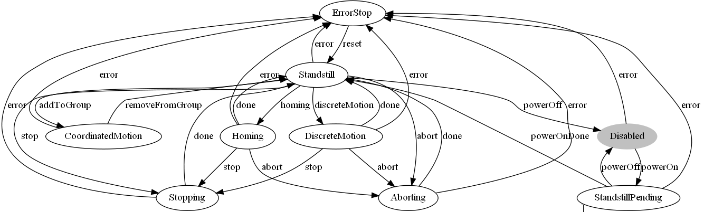
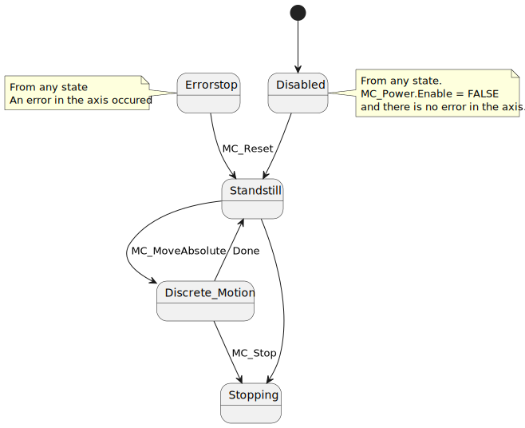
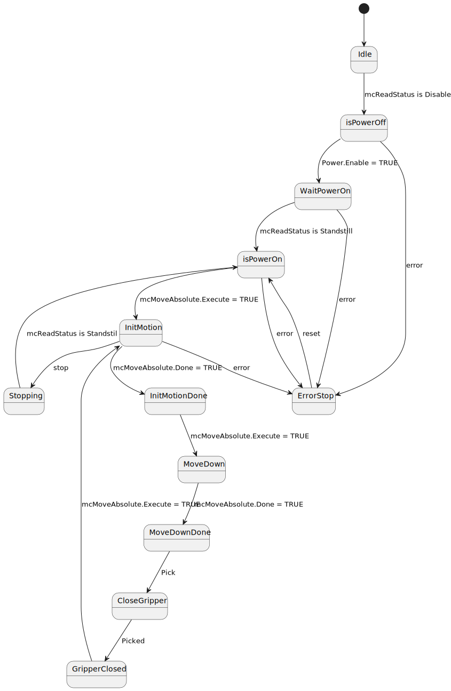
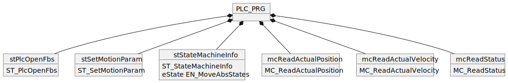
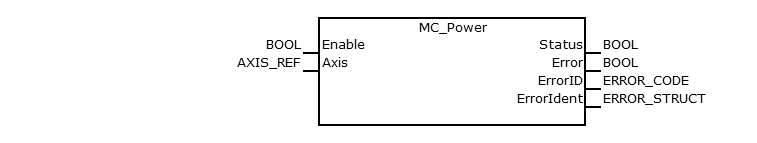
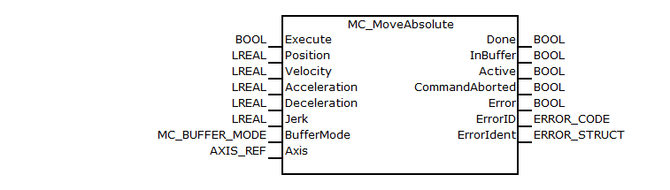
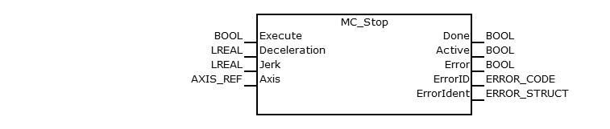
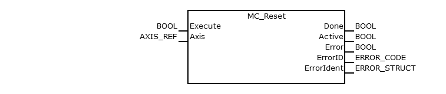

<h1 align="left">
  <br>
  
  <br>
  HEI-Vs Engineering School - Industrial Automation Base
  <br>
</h1>

Cours AutB

Author: [Cédric Lenoir](mailto:cedric.lenoir@hevs.ch)

# LAB 06 Verwaltung einer diskreten Bewegung.

*Schlüsselwörter:* **PLCopen State Machine MC_Power MC_MoveAbsolute MC_ReadStatus**

# Zielsetzung
Steuern Sie eine Achse mit Funktionsblöcken gemäß dem PLCopen-Standard [PLCopen Motion Control Specifications](https://plcopen.org/technical-activities/motion-control) unter Verwendung einer robusten Zustandsmaschine, die durch ``Enum`` definiert ist.

In dieser Arbeit werden wir nur absolute Bewegungen mit Trajektorien ausführen, die durch einen **MC_MoveAbsolute** definiert sind.

# Erinnerungsbewegungszustandsdiagramm
Von Hersteller zu Hersteller kann es leichte Unterschiede geben, aber abgesehen von ``StandstillPending`` finden wir immer die anderen Zustände.

Der Zustand **CoordinatedMotion** ist spezifisch für eine Maschine mit mehreren koordinierten Achsen.

<figure>
    
    <figcaption>PLCopen Axis State Machine</figcaption>
</figure>

Im Rahmen des Automatisierungskurses werden wir folgende Zustände verwenden:

<figure>
    
    <figcaption>Automation Lab State Diagram</figcaption>
</figure>


# Die Arbeit
> Aus Gründen der Lesbarkeit werden nicht alle Übergänge zu ErrorStop angezeigt, aber in der Praxis hat **jeder Zustand einen Übergang zu ErrorStop**.

> **Keine Übergänge außerhalb von ``CASE..OF`` sind zulässig**, außer um das System in den Leerlauf zurückzusetzen.

> **Das ``Execute`` und ``Enable`` der Befehls-FBs hängen nur von den Zuständen von ``CASE..OF``** ab, außer im manuellen Modus.

Einige Einschränkungen mögen übertrieben erscheinen, es handelt sich jedoch um eine Übung in der Programmiergenauigkeit.


<figure>
    
    <figcaption>State Machine Practical Work Move Absolute</figcaption>
</figure>

# Available structures ``STRUCT``.
## List of commands for MoveAbsolute ``ST_PlcOpenFbs``
```iecst
TYPE ST_PlcOpenFbs :
STRUCT
    // If TRUE, the FB are driven manually from the HMI
    bEnableRemote        : BOOL;
    bEnableReadStatus    : BOOL;
    bEnableReadPosition  : BOOL;
    bEnableReadVelocity  : BOOL;
    bMoveAbs             : BOOL;
    bStop                : BOOL;
    bPowerOn             : BOOL;
    bReset               : BOOL;
    // From arAxisStatus_gb[1].Data.PLCopenState;
    // Exist in Data Layer too, s=motion/axs/Axis_X/state/opstate/plcopen
    strGetAxisStatus     : STRING;
END_STRUCT
END_TYPE
```

> Die Variablen ``bEnableRemote``, ``bMoveAbs``, ``bStop``, ``bPowerOn``, ``bReset`` dienen der manuellen Steuerung von Funktionsblöcken, beispielsweise mit einem ODER bei einem Execute

```iecst
mcStop(Axis := GVL_AxisDefines.X_Axis,
       Execute := (state = stateStop) OR
                  (stPlcOpenFbs.bEnableRemote AND stPlcOpenFbs.bStop));
```

## List of dynamic parameters for ``MC_MoveAbs``

```iecst
TYPE ST_SetMotionParam :
STRUCT
    rPosition_mm        : LREAL;
    rVeloctiy_mm_s      : LREAL;
    rAcceleration_mm_s2 : LREAL;
    rDeceleration_m_s2  : LREAL;
    rJerk_m_s3          : LREAL;
END_STRUCT
END_TYPE
```

## List of State Machine Status ``ST_StateMachineInfo``

```iecst
TYPE ST_StateMachineInfo :
STRUCT
    diState     : DINT;
    eState      : EN_MoveAbsStates;
    bIdle       : BOOL;
    bActive     : BOOL;
    bError      : BOOL;
    strState    : STRING;
END_STRUCT
END_TYPE
```

> Beachten Sie die Variable ``strState`` vom Typ ``STRING``, die im Code verwendet werden kann, um die Zustandsmaschine zu dokumentieren und die Maschinendiagnose zu vereinfachen.

```iecst
(*
    Main State Machine.
*)
CASE stStateMachineInfo.eState OF
    EN_MoveAbsStates.eIdle :
        stStateMachineInfo.strState := 'Idle';
        ;
```

## Enum for state
Integrated in ``ST_StateMachineInfo``, to be completed.

```iecst
TYPE EN_MoveAbsStates :
(
    eIdle := 999
)DINT := eIdle;
END_TYPE
```

#HMI
Es wird eine Standardschnittstelle bereitgestellt. Es nutzt die oben genannten, in das Hauptprogramm integrierten Strukturen sowie einige Hilfsfunktionen.

<Abbildung>
     
     <figcaption>Praktische Arbeit06 Basisklassenobjekte</figcaption>
</figure>

Beachten Sie, dass dieses Diagramm nicht die ``Funktionsblöcke`` enthält, die für die **Bewegungssteuerung** erforderlich sind.

# Hauptfunktionsbausteine ​​PLCopen

## AXIS_REF
Wir haben normalerweise einen Zugriff vom Typ ``VAR_IN_OUT``, der jedem ``Funktionsblock`` eine Achse bereitstellt, auf die im **Motion Control**-Kern verwiesen wird.

In dem uns zur Verfügung stehenden System verwenden wir eine spezielle Funktion, die es uns ermöglicht, den Verweis auf die Struktur für ``AXIS_REF`` abzurufen.

Siehe unter ``GVL_AxisDefines``.

``iecst
VAR_GLOBAL
X_Axis: MB_AXISIF_REF :=(AxisName:='Axis_1',AxisNo:=1);
END_VAR
``
Es ist dieser ``X_Axis``-Wert, der beim Aufruf eines FBs für Motion Control zwingend verwendet wird, beispielsweise für ``MC_Stop``:

```iecst

mcStop(Axis := GVL_AxisDefines.X_Axis,
       Deceleration := 1,
       Execute := stPlcOpenFbs.bStop);
```

## MC_Power 
### Short description
The function block controls the power adding (on or off).

<figure>
    
    <figcaption>MC_Power, source: Bosch Rexroth</figcaption>
</figure>

### Functional description
The function block implements the transition between the PLCopen states **DISABLED** and **STANDSTILL**.

This function is prerequisite for every motion command which moves an axis.

There is no differentiation between real or simulated axes.
### Possible error codes
The function block uses the CXA_TABLE, refer to CXA_Commontypes.ERROR_TABLE
Error detail information please see CXA_MOTION_ERR.

|Scope      |Name        |Type   |Comment    |
|-----------|------------|-------|-----------|
|VAR_INPUT  |``Enable``     |BOOL   |As long as ``Enable`` is true, power is being enabled|
|VAR_OUTPUT |``Status``      |BOOL   |Power state|
|VAR_OUTPUT |``Error``       |BOOL   |Indicates an error|
|VAR_OUTPUT |``ErrorID``     |ERROR_CODE|Class of error|
|VAR_OUTPUT |``ErrorIdent``  |ERROR_STRUCT |Detailed information about error|
|VAR_IN_OUT |``Axis``        |AXIS_REF     |Reference to the axis ``CONST``|

## MC_MoveAbsolute
### Short description
This Function Block commands a controlled motion to a specified absolute position.

<figure>
    
    <figcaption>MC_MoveAbsolute, source: Bosch Rexroth</figcaption>
</figure>

### Functional description
Prerequisite: The axis has to be in a powered state by **MC_Power**.

During the movement, the PLCopen state of the axis is set to DISCRETE_MOTION.
When the commanded target position is reached, the function block is set to state Done and the PLCopen state of the corresponding axis is set to **STANDSTILL**.

You can use **MC_ReadStatus** to determine the current state.

In case an error occurred before execution (e.g. violated dynamic limits, invalid command parameters) the function block will be set to state ``Error``.
In case an error occurred during execution, the axis state is set to **ERRORSTOP**.

If the function block is set as a ``mcAborting`` mode, all previous commands are discarded and the currently executed commanded will be interrupted.
In this case, the axis will still move continuously (within its new commanded dynamic limits) towards the new target position.

If the function block is set as a ``mcBuffered`` mode, this command will be buffered until all previous commands are executed done and the currently executed commanded will not be interrupted.
In this case, the axis will still move to velocity-zero and then move (within its new commanded dynamic limits) towards the new target position.

If the function block is interrupted by another function block which is set as ``mcAborting`` mode or **MC_STOP**, it will be set to state ``CommandAborted``.

If the function block works in ``Active`` state. It means current function block is executed

### Possible error codes
The function block uses the CXA_TABLE, refer to CXA_Commontypes.ERROR_TABLE

Error detail information please see CXA_MOTION_ERR.

|Scope      |Name        |Type   |Comment    |
|-----------|------------|-------|-----------|
|VAR_INPUT  |``Execute``     |BOOL   |Start the motion at rising edge|
|VAR_INPUT  |``Position``    |LREAL  |Commanded ``Position`` for the motion, *in technical unit* ``[u]``, negative or positive|
|VAR_INPUT  |``Velocity``    |LREAL  |Value of the maximum ``Velocity``, *not necessarily reached* ``[u/s]``.|
|VAR_INPUT  |``Acceleration``|LREAL  |Value of the ‘Acceleration’, always positive, *increasing energy of the motor* ``[u/s2]``|
|VAR_INPUT  |``Deceleration``|LREAL  |Value of the ‘Deceleration’, always positive, *decreasing energy of the motor* ``[u/s2]``|
|VAR_INPUT  |``Jerk``        |LREAL  |Value of ‘jerk’ (always positive) [u/s3]|
|VAR_INPUT  |``BufferMode``  |MC_BUFFER_MODE  |defines this FB execute immediately or push into the buffer|
|VAR_OUTPUT |``Done``        |BOOL   |Commanded position finally reached|
|VAR_OUTPUT |``InBuffer``      |BOOL   |Command is queued and to be executed.|
|VAR_OUTPUT |``Active``      |BOOL   |Execution in progress|
|VAR_OUTPUT |``CommandAborted``|BOOL   |``Command`` is aborted by another command|
|VAR_OUTPUT |``Error``       |BOOL   |Indicates an error|
|VAR_OUTPUT |``ErrorID``     |ERROR_CODE|Class of error|
|VAR_OUTPUT |``ErrorIdent``  |ERROR_STRUCT |Detailed information about error|
|VAR_IN_OUT |``Axis``        |AXIS_REF     |Reference to the axis ``CONST``|

## MC_Stop
### Short description
This function block generates a slowdown, **within the given dynamic limits**, until the axis is stopped, **velocity zero**.

<figure>
    
    <figcaption>MC_Stop, source: Bosch Rexroth</figcaption>
</figure>

### Functional description
During slowdown, the axis in state of **STOPPING**.

After the axis is stopped, the output Done is set and the PLCopen statemachine of the corresponding axis is set to state **STANDSTILL**.

This function block abort any ongoing function block execution. When **STANDSTILL** is reached the position is kept active.
### Possible error codes
The function block uses the CXA_TABLE, refer to CXA_Commontypes.ERROR_TABLE

Error detail information please see CXA_MOTION_ERR.

|Scope      |Name        |Type   |Comment    |
|-----------|------------|-------|-----------|
|VAR_INPUT  |``Execute``     |BOOL   |Start the action at rising edge|
|VAR_INPUT  |``Deceleration``|LREAL  |Value of *deceleration*, always positive, ``[u/s2]``|
|VAR_INPUT  |``Jerk``        |LREAL  |Value of ‘jerk’ (always positive) [u/s3]|
|VAR_OUTPUT |``Done``        |BOOL   |Execution finished|
|VAR_OUTPUT |``Active``      |BOOL   |Execution in progress|
|VAR_OUTPUT |``Error``       |BOOL   |Indicates an error|
|VAR_OUTPUT |``ErrorID``     |ERROR_CODE|Class of error|
|VAR_OUTPUT |``ErrorIdent``  |ERROR_STRUCT |Detailed information about error|
|VAR_IN_OUT |``Axis``        |AXIS_REF     |Reference to the axis ``CONST``|

## MC_Reset
### Short description
The function block resets all reported errors of an axis

<figure>
    
    <figcaption>MC_Reset, source: Bosch Rexroth</figcaption>
</figure>

### Functional description
Prerequisite: The axis must not be added to an axes group.

Implements the transition from the **ERRORSTOP** state to the **STANDSTILL** or **DISABLED** depending on its previous power state.

Axis-internal errors are deleted.

If there is no error present, triggering **MC_Reset** has no effect.
### Possible error codes
The function block uses the CXA_TABLE, refer to CXA_Commontypes.ERROR_TABLE

Error detail information please see CXA_MOTION_ERR.

|Scope      |Name        |Type   |Comment    |
|-----------|------------|-------|-----------|
|VAR_INPUT  |``Execute``     |BOOL   |Resets all internal axis-related errors|
|VAR_OUTPUT |``Done``        |BOOL   |Execution finished|
|VAR_OUTPUT |``Active``      |BOOL   |Execution in progress|
|VAR_OUTPUT |``Error``       |BOOL   |Indicates an error|
|VAR_OUTPUT |``ErrorID``     |ERROR_CODE|Class of error|
|VAR_OUTPUT |``ErrorIdent``  |ERROR_STRUCT |Detailed information about error|
|VAR_IN_OUT |``Axis``        |AXIS_REF     |Reference to the axis ``CONST``|

# Nächster Schritt, kontinuierlich.
Sobald das Prinzip erlernt ist, kann die Arbeit mit folgender Reihenfolge fortgesetzt werden:

- Nimm eine Münze.
- Heben Sie es an
- Ruhe dich aus
- Rückkehr zum Ausgangszustand
- Fahren Sie fort, solange kein Stoppbefehl vorliegt.

# Nächster Schritt, Integration der Y-Achse.
Wenn das Prinzip verstanden ist, werden wir die Y-Achse integrieren, um das Teil von einem Ort zum anderen zu bewegen.

# Vollständige Integration
Es wird festgestellt, dass die Anwendung des Prinzips für ein Gesamtsystem schnell unüberschaubar wird.
Eine Möglichkeit besteht darin, einen ``Funktionsblock`` zu entwickeln, der ein vollständiges **Pick & Place** mit der Einstellung der Startposition **Pick** und der Endposition **Place** integriert.